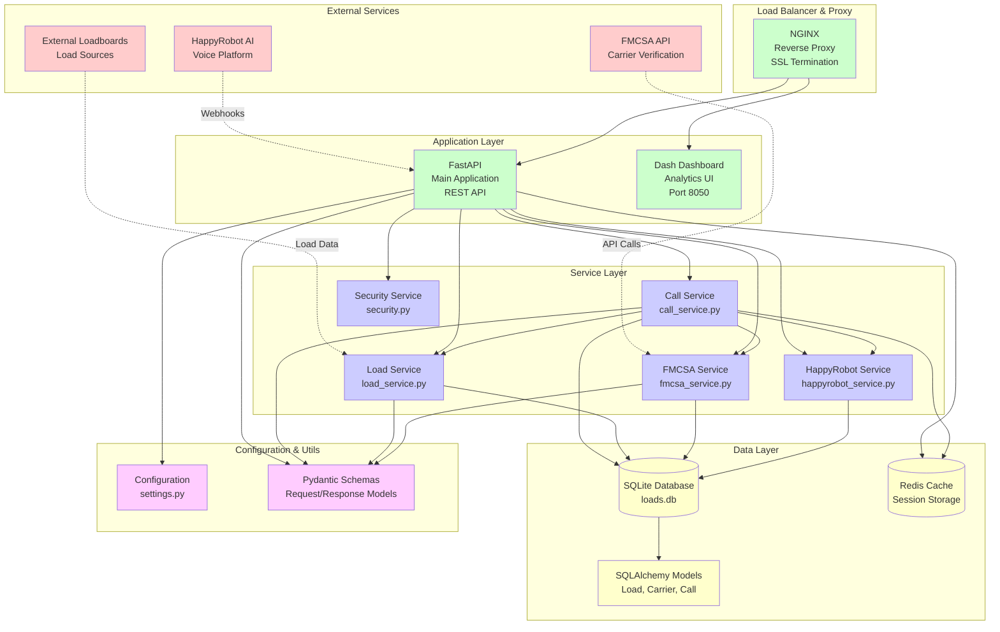
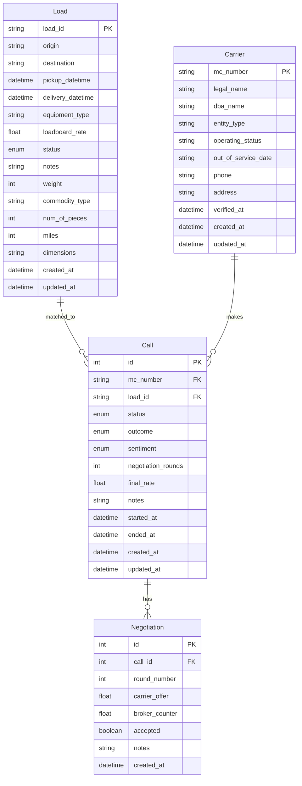
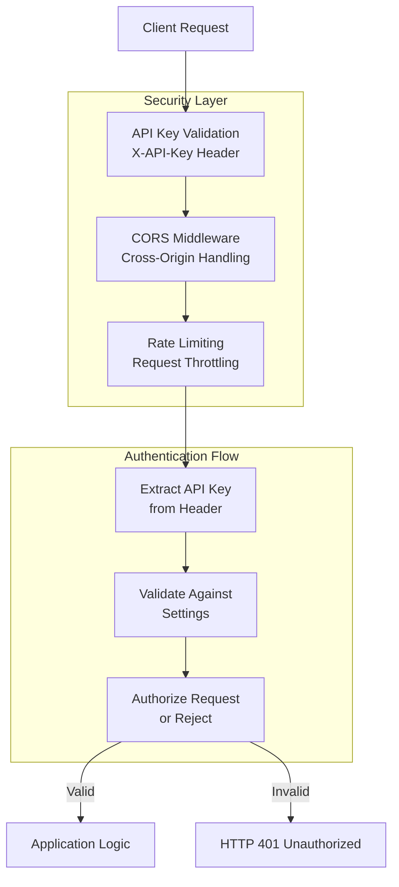
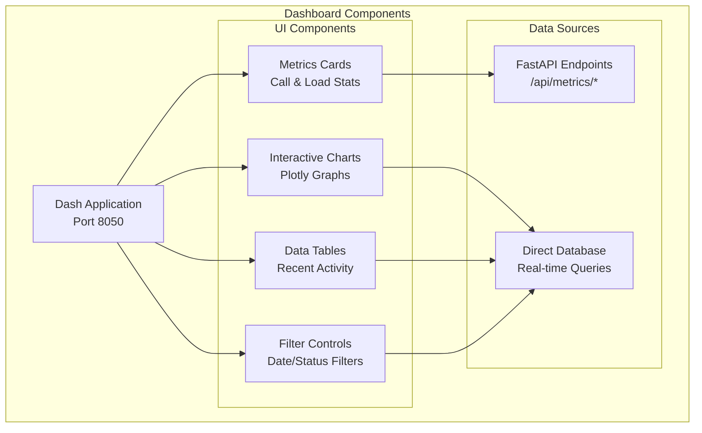
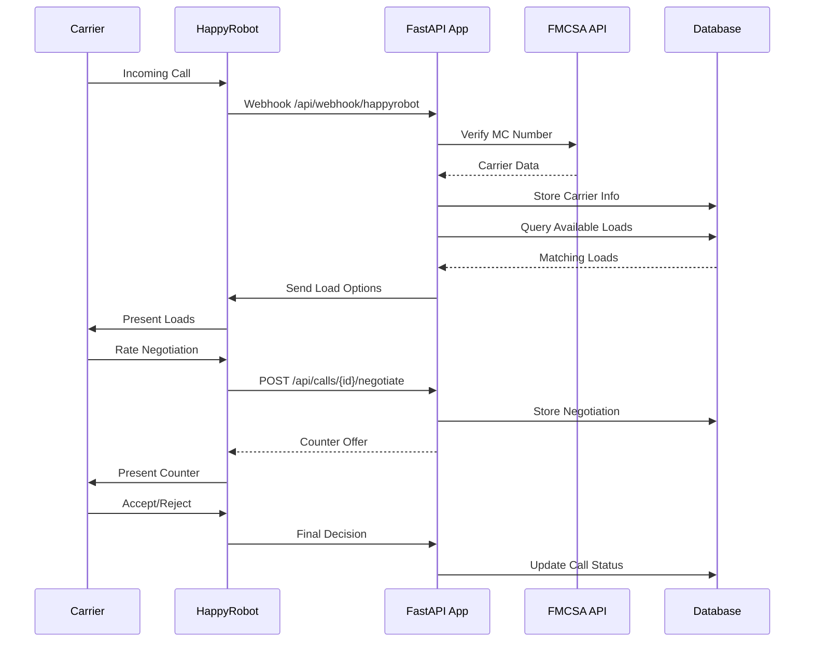

# Inbound Sales AI Agent - Architecture Diagram

## System Overview



## Detailed Component Architecture

### 1. API Gateway & Load Balancing
- **NGINX**: Reverse proxy, SSL termination, static file serving
- **FastAPI**: Main application server with automatic OpenAPI documentation
- **CORS Middleware**: Cross-origin request handling

### 2. Core Services Architecture

```mermaid
graph LR
    subgraph "FastAPI Endpoints"
        LOAD_EP[Load Management<br/>/api/loads/*]
        CALL_EP[Call Handling<br/>/api/calls/*]
        CARR_EP[Carrier Management<br/>/api/carriers/*]
        METR_EP[Metrics<br/>/api/metrics/*]
        HOOK_EP[Webhooks<br/>/api/webhook/*]
    end

    subgraph "Business Logic Services"
        CALL_SVC[CallHandlingService<br/>• start_call()<br/>• find_and_pitch_loads()<br/>• handle_negotiation()<br/>• end_call()]
        LOAD_SVC[LoadService<br/>• create_load()<br/>• get_available_loads()<br/>• search_loads()<br/>• match_criteria()]
        FMCSA_SVC[FMCSAService<br/>• verify_carrier()<br/>• check_eligibility()<br/>• parse_response()]
        HR_SVC[HappyRobotService<br/>• initiate_call()<br/>• handle_webhook()<br/>• process_transcript()]
    end

    LOAD_EP --> LOAD_SVC
    CALL_EP --> CALL_SVC
    CARR_EP --> FMCSA_SVC
    METR_EP --> CALL_SVC
    METR_EP --> LOAD_SVC
    HOOK_EP --> HR_SVC

    CALL_SVC --> LOAD_SVC
    CALL_SVC --> FMCSA_SVC
    CALL_SVC --> HR_SVC
```

### 3. Data Model Architecture



### 4. Security Architecture



### 5. Dashboard Architecture



### 6. External Integration Flow



## Technology Stack

### Backend Technologies
- **FastAPI**: Modern Python web framework
- **SQLAlchemy**: Python SQL toolkit and ORM
- **Pydantic**: Data validation using Python type annotations
- **SQLite**: Lightweight database for development
- **Redis**: In-memory data structure store for caching

### Frontend Technologies
- **Dash**: Python web application framework
- **Plotly**: Interactive graphing library
- **HTML/CSS**: Static templates and styling

### External Services
- **FMCSA API**: Federal Motor Carrier Safety Administration
- **HappyRobot**: AI voice platform for call handling

### DevOps & Deployment
- **Docker**: Containerization
- **Docker Compose**: Multi-container orchestration
- **NGINX**: Web server and reverse proxy
- **pytest**: Testing framework

## Key Features

### 1. Automated Call Handling
- Inbound carrier call processing
- Real-time carrier verification via FMCSA
- Intelligent load matching based on equipment and routes
- Automated price negotiation with fallback to human transfer

### 2. Load Management
- RESTful API for load operations (CRUD)
- Advanced search and filtering capabilities
- Status tracking throughout load lifecycle
- Integration with external loadboards

### 3. Real-time Analytics
- Interactive dashboard with live metrics
- Call conversion tracking
- Load performance analysis
- Carrier sentiment monitoring

### 4. Security & Compliance
- API key authentication
- Request rate limiting
- CORS handling for web clients
- FMCSA compliance for carrier verification

### 5. Scalable Architecture
- Microservices-oriented design
- Containerized deployment
- Horizontal scaling capabilities
- Redis caching for performance

This architecture provides a robust, scalable solution for automating inbound carrier sales while maintaining compliance and providing comprehensive analytics.
